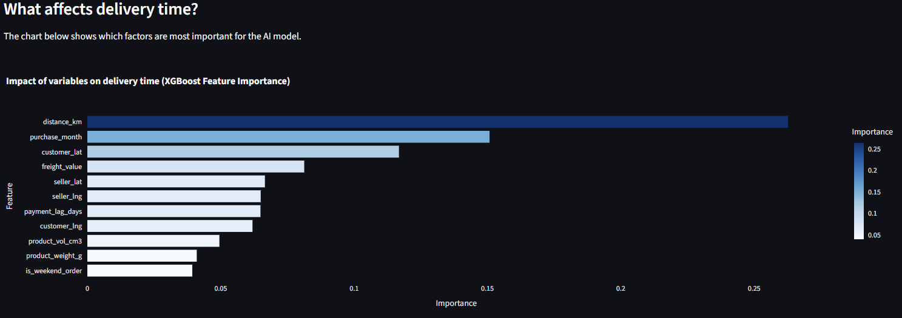
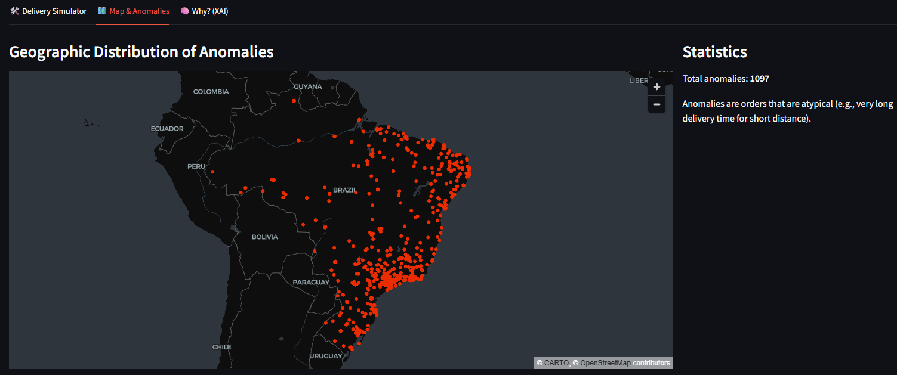
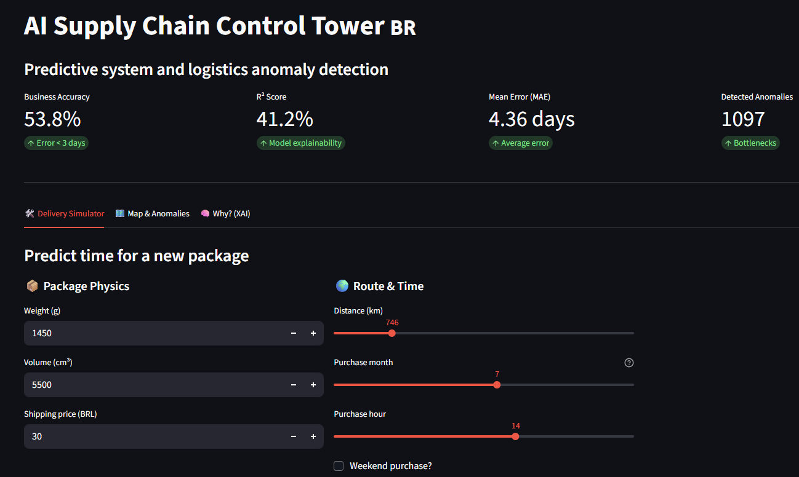

# Logistics AI Control Tower

Production-ready delivery time prediction system for Brazilian e-commerce with FastAPI backend and Streamlit dashboard. This project analyzes data from Olist - one of the largest marketplace platforms in Brazil.

## Business Problem

E-commerce customers want to know when their package will arrive. Sellers want to optimize logistics. This project answers the question: **can we predict delivery time based on available data?**

Spoiler: yes, but only partially (~41% of variance). The rest depends on things we don't have in the data - weather, traffic, courier availability.

## Results

- **R² Score**: 41.2%
- **Mean Error (MAE)**: 4.4 days
- **Business Accuracy** (<3 days error): 54%

Is this good? For delivery time prediction - yes, it's a decent result. Most factors affecting delivery are outside transactional data.

## Architecture

```
┌─────────────────┐      HTTP/REST       ┌──────────────────┐
│   Streamlit     │ ◄──────────────────► │   FastAPI        │
│   Dashboard     │     (httpx)          │   Backend        │
│   Port: 8501    │                      │   Port: 8000     │
└─────────────────┘                      └──────────────────┘
                                                   │
                                                   ▼
                                         ┌──────────────────┐
                                         │  XGBoost Model   │
                                         │  Isolation Forest│
                                         │  Kaggle Dataset  │
                                         └──────────────────┘
```

## Project Structure

```
├── .github/
│   ├── workflows/
│   │   └── main.yml              # CI: pytest + Docker build
│   └── copilot-instructions.md   # AI coding conventions
├── src/
│   ├── __init__.py
│   ├── api.py                    # FastAPI endpoints + Pydantic schemas
│   ├── loader.py                 # Kaggle data fetching
│   ├── processing.py             # Feature engineering (Haversine, time features)
│   ├── model.py                  # Isolation Forest anomaly detection
│   ├── prediction.py             # XGBoost training & evaluation
│   └── dashboard.py              # Streamlit UI with httpx API calls
├── tests/
│   └── test_logic.py             # API endpoint tests with mocks
├── screenshots/
│   ├── feature-importance.png
│   ├── geographic-distribution-of-anomalies.png
│   └── metrics-and-delivery-simulator.png
├── Dockerfile                    # FastAPI production image
├── Dockerfile.dashboard          # Streamlit dashboard image
├── docker-compose.yml            # Multi-container orchestration
├── requirements.txt
└── README.md
```

## Key Model Features

After several iterations, the most important features turned out to be:
- **Distance** (~26%) - calculated using Haversine formula from lat/lng
- **Purchase month** (~15%) - seasonality (Black Friday, holidays)
- **Customer location** (~11%) - some regions have weaker infrastructure
- **Payment lag** (~9%) - time between purchase and payment approval
- **Package dimensions** - weight & volume combined (~12%)

## Tech Stack

### Backend
- **FastAPI** 0.115+ - Modern async web framework
- **XGBoost** - Gradient boosting for regression
- **Scikit-learn** - Preprocessing & Isolation Forest
- **KaggleHub** - Automated dataset downloads

### Frontend
- **Streamlit** 1.40+ - Interactive dashboard
- **httpx** - HTTP client for API communication
- **Plotly** - Interactive visualizations
- **Pandas** - Data manipulation

### Infrastructure
- **Docker** - Multi-stage builds with non-root users
- **Docker Compose** - Service orchestration with health checks
- **GitHub Actions** - Continuous Integration (pytest + Docker image validation)
- **Pytest** - Unit testing with unittest.mock

## API Endpoints

### `GET /`
Returns API information and available endpoints.

### `GET /health`
```json
{
  "status": "ready",
  "records": 109635,
  "r2_score": 0.4117,
  "mae": 4.36
}
```

### `POST /predict`
**Request:**
```json
{
  "product_weight_g": 1200.0,
  "product_vol_cm3": 4500.0,
  "distance_km": 800.0,
  "customer_lat": -23.55,
  "customer_lng": -46.63,
  "seller_lat": -23.95,
  "seller_lng": -46.33,
  "payment_lag_days": 2.0,
  "is_weekend_order": false,
  "freight_value": 29.9,
  "purchase_month": 11
}
```

**Response:**
```json
{
  "predicted_days": 7.5,
  "r2_score": 0.4117,
  "mae": 4.36,
  "warnings": []
}
```

## How to Run

### Docker (Recommended)

```bash
# Build and start both services
docker-compose up --build

# Access services
# API: http://localhost:8000/docs
# Dashboard: http://localhost:8501
```

### Locally

**1. Start FastAPI Backend:**
```bash
pip install -r requirements.txt
uvicorn src.api:app --reload --port 8000
```

**2. Start Streamlit Dashboard:**
```bash
# Windows
set DELIVERY_API_URL=http://localhost:8000
streamlit run src/dashboard.py

# macOS/Linux
export DELIVERY_API_URL=http://localhost:8000
streamlit run src/dashboard.py
```

### Development

```bash
# Run tests with module import
python -m pytest tests/ -v

# Format code
black src/ tests/

# Type checking
mypy src/
```

## Continuous Integration (CI)

### GitHub Actions (`.github/workflows/main.yml`)

The project uses a Continuous Integration (CI) pipeline that runs automatically on every push and pull request to the `main` and `master` branches.

**Job 1 – Quality & Tests**

- ✅ Set up Python 3.12
- ✅ Install project dependencies
- ✅ Run unit tests using `python -m pytest`

**Job 2 – Docker Validation**

- 🐳 Build FastAPI Docker image
- 🐳 Build Streamlit Docker image
- 📦 Validate that both production images build successfully

**Current scope**

- ✔ Automated testing
- ✔ Docker image validation
- ✖ Automatic deployment is intentionally performed manually

## FastAPI Features

- **Async/Await**: Non-blocking I/O for concurrent requests
- **OpenAPI Docs**: Auto-generated at `/docs` and `/redoc`
- **CORS Middleware**: Configured for cross-origin requests
- **Lifespan Events**: Model loading on startup (replaces deprecated `on_event`)
- **Error Handling**: 503 when model not ready, 422 for validation errors

## Dashboard Features

- 🔮 **Delivery Simulator** - Interactive prediction with real-time API calls
- 🗺️ **Geographic Map** - Anomaly distribution across Brazil (Plotly)
- 🧠 **XAI (Explainability)** - Feature importance visualization
- 📊 **KPI Metrics** - R², MAE, business accuracy
- ⚡ **Real-time Updates** - Async-ready HTTP requests to FastAPI backend with httpx

## Production Considerations

- ⚠️ **Kaggle Downloads**: Model loads dataset on startup (~43MB). Consider caching in production.
- 🔒 **Security**: Non-root Docker users, CORS configured for specific origins
- 📈 **Scaling**: FastAPI can run with multiple workers (`--workers 4`)
- 💾 **Persistence**: Model is retrained on startup. Save trained model to disk for faster startups.
- 🔍 **Monitoring**: `/health` endpoint for liveness/readiness probes

## Dashboard Preview

### Feature Importance


### Geographic Distribution of Anomalies


### Metrics and Delivery Simulator


## Dataset

[Olist Brazilian E-Commerce](https://www.kaggle.com/datasets/olistbr/brazilian-ecommerce) - public dataset with ~100k orders from 2016-2018.

---
